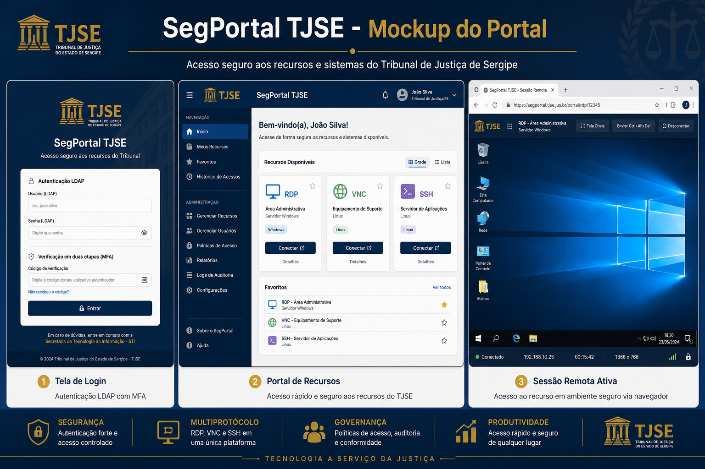
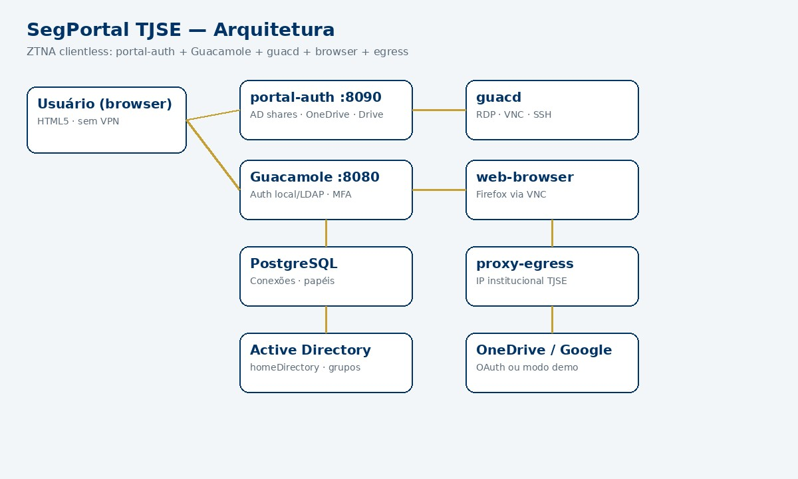
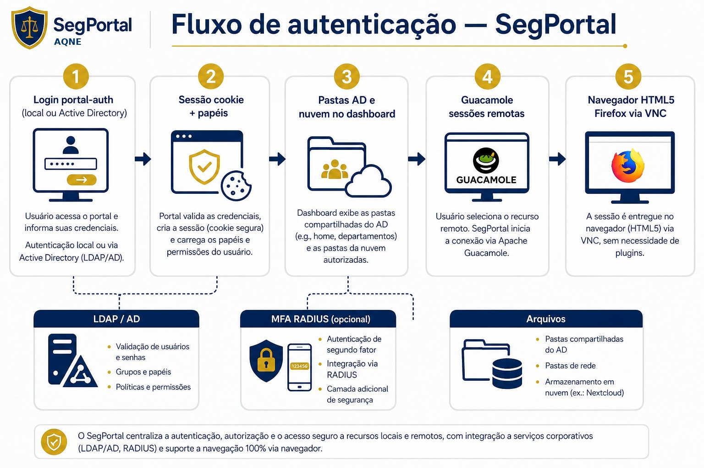
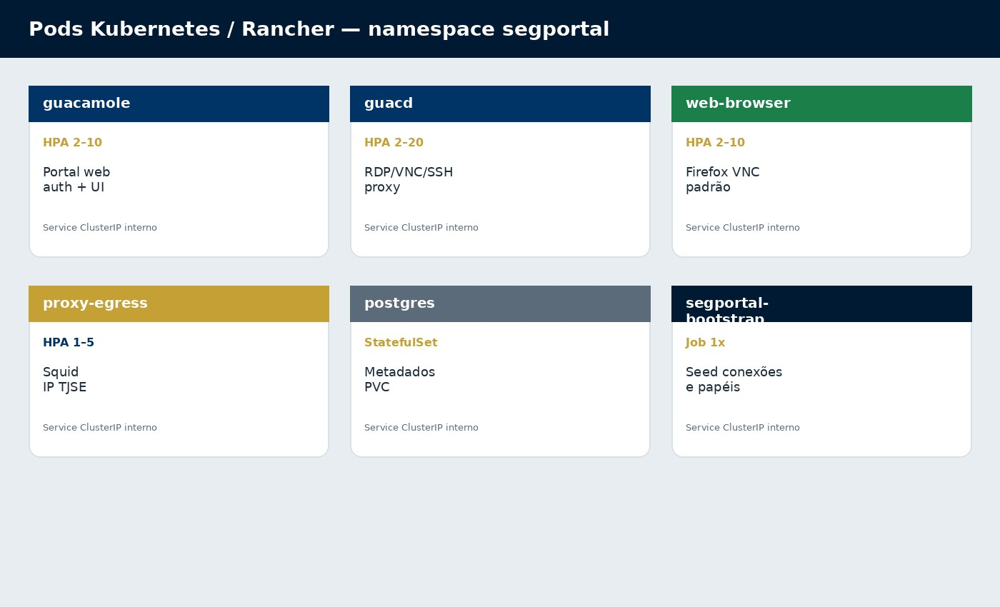
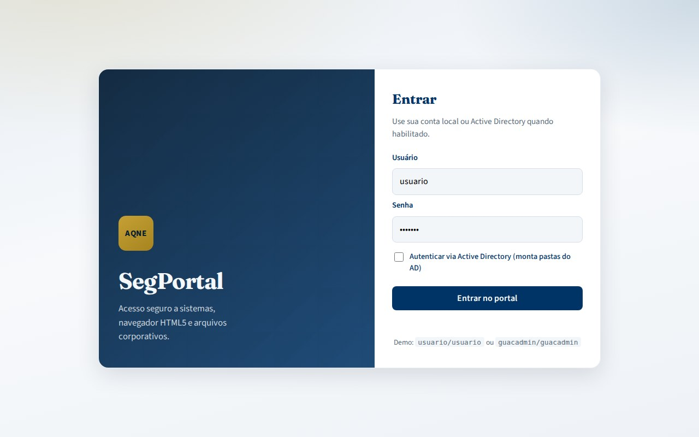
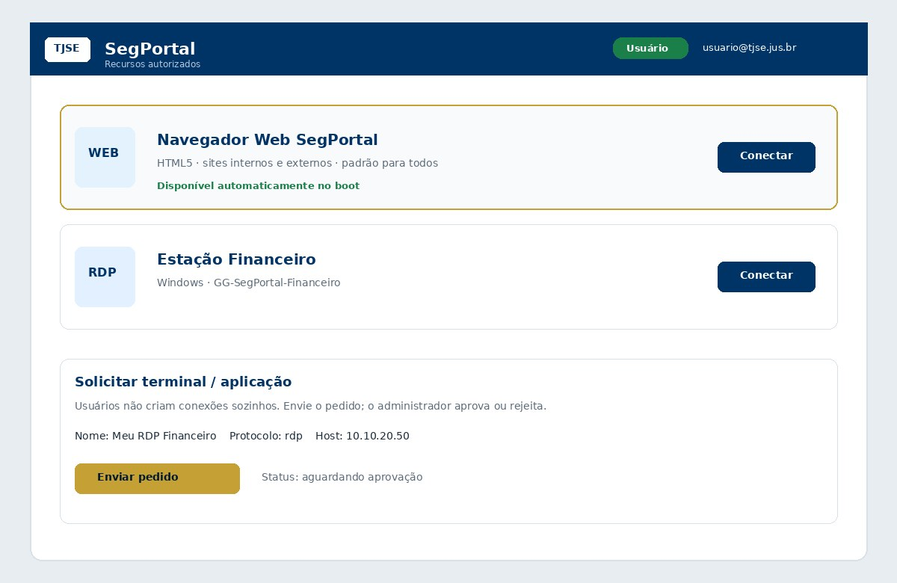
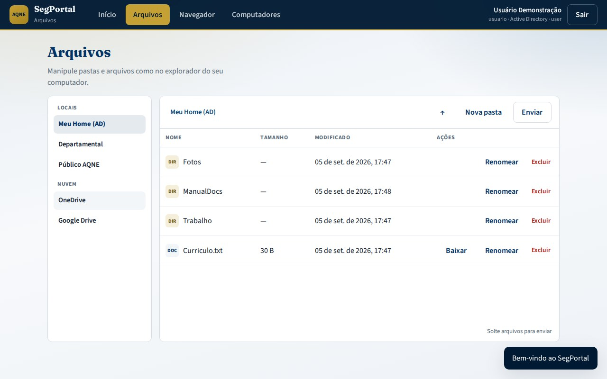
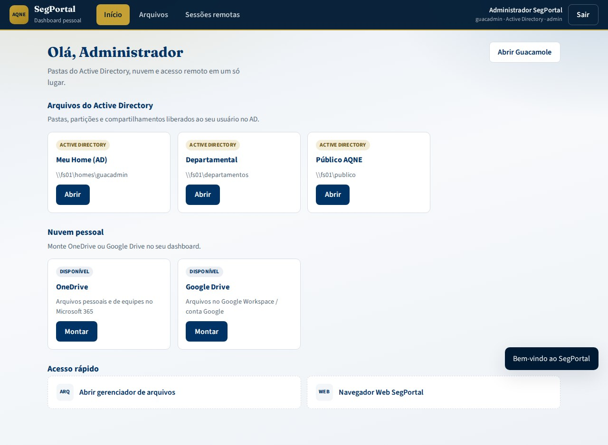

# SegPortal — Portal ZTNA do AQNE

**Versão:** 2026-10-02 (auth local via ENV · LDAP real via ldap3 · MFA TOTP · rate limiting · catálogo server-side)

[](https://github.com/avilarezende/segportal/actions/workflows/ci.yml)

**Repositório:** https://github.com/avilarezende/segportal

**SegPortal** é o portal de acesso seguro do **AQNE**. Com acesso clientless HTML5, substitui a VPN interna por um modelo **ZTNA** (Zero Trust Network Access): autenticação local (provisionada por variáveis de ambiente) e/ou LDAP (`aqne.jus.br`) com MFA TOTP opcional, e acesso a RDP, VNC, SSH e navegação web **direto no navegador**, sem cliente VPN.

---

## Para quem é este projeto

| Público | O que encontrar aqui |
|---------|----------------------|
| **Usuário final** | [Manual do usuário](docs/USER_MANUAL.md) · [guia visual](docs/USAGE.md) · [arquivos/nuvem](docs/FILES.md) |
| **Administrador** | [Manual do administrador](docs/ADMIN_MANUAL.md) · [Configuração](docs/CONFIGURATION.md) |
| **Infraestrutura** | [Deploy](docs/DEPLOYMENT.md) — Rancher, pods, secrets |
| **Desenvolvimento** | [Arquitetura](docs/ARCHITECTURE.md) e [CI/CD](docs/CI_CD.md) |

---

## Mockup do portal



*Login, portal com navegador HTML padrão, sessão clientless e painel admin de aprovações.*

Preview interativo: [docs/mockup/segportal-preview.html](docs/mockup/segportal-preview.html)

---

## Arquitetura



| Componente | Função | Pod K8s |
|------------|--------|---------|
| **SegPortal** | Portal web, autenticação e autorização | `sessions` (HPA 2–10) |
| **guacd** | Proxy RDP, VNC e SSH | `guacd` (HPA 2–20) |
| **PostgreSQL** | Metadados de conexões e sessões | `postgres` (StatefulSet) |
| **Proxy egress** | Navegação HTTP com IP institucional AQNE | `proxy-egress` (HPA 1–5) |
| **Web browser** | Firefox via VNC — navegador HTML **padrão** | `web-browser` (HPA 2–10) |
| **Portal auth** | Dashboard pessoal: AD shares, OneDrive/Google Drive, file manager | `portal-auth` |
| **Bootstrap** | Conexão padrão + papéis no banco | Job `segportal-bootstrap` |





---

## Exemplos de uso

| Etapa | Imagem | Descrição |
|-------|--------|-----------|
| **1. Login** |  | Credenciais locais ou AD (+ MFA no SegPortal, se habilitado) |
| **2. Dashboard** |  | Pastas AD, OneDrive/Google Drive e atalhos |
| **3. Arquivos** |  | Gerenciador HTML (upload, pastas, nuvem) |
| **4. Navegador HTML5** |  | Firefox no portal acessando o site do **Bacen** (`bcb.gov.br`) |
| **5. Sessão / Admin** |  | Sessões remotas e visão administrativa |

---

## Início rápido (desenvolvimento local)

### Pré-requisitos

- Docker e Docker Compose v2
- Git

### Passos

```bash
git clone https://github.com/avilarezende/segportal.git
cd segportal
cp .env.example .env
# Edite .env — obrigatório: POSTGRES_PASSWORD, PORTAL_SESSION_SECRET,
# SEGPORTAL_LOCAL_USERS + SEGPORTAL_LOCAL_PASSWORDS, GUACAMOLE_ADMIN_PASSWORD, VNC_PASSWORD
# (LDAP/RADIUS/TOTP opcionais — ver docs/CONFIGURATION.md)
docker compose up --build
```

> O portal **não inicia** sem `PORTAL_SESSION_SECRET` definida. Sem `SEGPORTAL_LOCAL_USERS`/`SEGPORTAL_LOCAL_PASSWORDS` não há usuários locais.

Acesse:
- **Dashboard pessoal (arquivos AD + nuvem):** http://localhost:8090  
- **SegPortal (sessões remotas):** http://localhost:8090

No primeiro boot o serviço `segportal-bootstrap` cria schema (se preciso), papéis, o admin (`GUACAMOLE_ADMIN_PASSWORD`) e a conexão **Navegador Web SegPortal** (Firefox via VNC) liberada para todos.

Ambiente local **sem LDAP** — usuários vêm de variáveis de ambiente (não existem mais senhas demo no código):

```bash
SEGPORTAL_LOCAL_USERS="admin:Administrador:admin:admin@aqne.jus.br;usuario:Usuário Padrão:user:usuario@aqne.jus.br"
SEGPORTAL_LOCAL_PASSWORDS="<senha_do_admin>;<senha_do_usuario>"
docker compose -f docker-compose.dev.yml up --build
```

Formato de `SEGPORTAL_LOCAL_USERS`: `login:Nome de exibição:Papel:email;...` (papel `admin` ou `user`), com as senhas na **mesma ordem** em `SEGPORTAL_LOCAL_PASSWORDS` (separadas por `;`). Mais detalhes: [docs/LOCAL_ADMIN.md](docs/LOCAL_ADMIN.md).

Detalhes: [docs/CONNECTIONS.md](docs/CONNECTIONS.md)

### Deploy em produção (Kubernetes / Rancher)

```bash
# 1. Criar secrets (ver docs/CONFIGURATION.md)
kubectl apply -k k8s/overlays/production
# Job segportal-bootstrap aplica navegador padrão automaticamente
```

---

## Configuração essencial

| Item | Arquivo / variável | Detalhes |
|------|-------------------|----------|
| **Papéis admin / usuário** | `config/roles/roles.yaml` | [ROLES.md](docs/ROLES.md) |
| **Usuários locais (obrigatório)** | `SEGPORTAL_LOCAL_USERS` + `SEGPORTAL_LOCAL_PASSWORDS` | [LOCAL_ADMIN.md](docs/LOCAL_ADMIN.md) |
| **Admin no bootstrap** | `GUACAMOLE_ADMIN_PASSWORD` (obrigatória) | [LOCAL_ADMIN.md](docs/LOCAL_ADMIN.md) |
| **Sessão (obrigatório)** | `PORTAL_SESSION_SECRET` — sem ela o portal **não inicia** | [ADMIN_MANUAL.md](docs/ADMIN_MANUAL.md) |
| LDAP (opcional) | `LDAP_ENABLED` (LDAP real via `ldap3`, fail-closed), `config/ldap/ldap-settings.yaml` | [CONFIGURATION.md](docs/CONFIGURATION.md#3-active-directory-ldap--opcional) |
| MFA RADIUS | `MFA_RADIUS_HOST`, `MFA_RADIUS_SECRET` | [CONFIGURATION.md](docs/CONFIGURATION.md#4-mfa-radius-e-totp) |
| MFA TOTP (2FA) | `SEGPORTAL_TOTP_SECRETS` (JSON por usuário) | [CONFIGURATION.md](docs/CONFIGURATION.md#4-mfa-radius-e-totp) |
| Rate limiting | `SEGPORTAL_RATE_LIMIT_ENABLED` | login 5/min · escrita 30/min |
| Senha VNC (obrigatória) | `VNC_PASSWORD` (web-browser) = `SEGPORTAL_VNC_PASSWORD` (bootstrap SQL) | [CONNECTIONS.md](docs/CONNECTIONS.md) |
| Navegador padrão | `web-browser` + bootstrap | [CONNECTIONS.md](docs/CONNECTIONS.md) |
| Sessões | `SESSION_TIMEOUT_MINUTES` | Timeout e limite de conexões |
| Proxy egress | `config/proxy/squid.conf` | Whitelist de domínios externos |
| Secrets K8s | `k8s/*/secret.example.yaml` | Copiar e preencher antes do deploy |

Guia passo a passo: **[docs/CONFIGURATION.md](docs/CONFIGURATION.md)**

---

## Estrutura do repositório

```
segportal/
├── config/              # sessions.properties, LDAP, Squid, papéis
├── docs/
│   ├── images/          # diagramas e mockups (JPG)
│   ├── mockup/          # preview HTML interativo
│   ├── MANUAL.md        # manual usuário + admin
│   ├── USAGE.md         # guia visual de uso
│   ├── CONFIGURATION.md # configuração
│   └── ...
├── k8s/                 # manifests Kubernetes modulares
│   ├── web-browser/     # Firefox padrão
│   ├── bootstrap/       # Job de seed automático
│   └── overlays/
├── services/            # Dockerfiles por componente
├── scripts/             # bootstrap, pedidos, admin local
└── tests/               # validação automatizada
```

---

## Segurança

- Autenticação **local provisionada via ENV** (`SEGPORTAL_LOCAL_USERS` / `SEGPORTAL_LOCAL_PASSWORDS`) — **sem as variáveis não há usuários locais** (nenhuma senha demo no código)
- LDAP **real via `ldap3`** quando habilitado — **fail-closed**: sem bind válido → `401`; usuário local autentica somente com LDAP desligado
- MFA **TOTP (2FA)** por usuário via `SEGPORTAL_TOTP_SECRETS` (login em 2 etapas)
- `PORTAL_SESSION_SECRET` **obrigatória** — o portal não inicia sem ela; cookie de sessão com `secure=True` (desative só em dev com `SEGPORTAL_COOKIE_SECURE=0`)
- Senhas **VNC obrigatórias** (`VNC_PASSWORD` / `SEGPORTAL_VNC_PASSWORD`) — sem defaults em claro
- **Rate limiting** (slowapi): login 5/min, escrita da API 30/min (desligável em dev)
- Catálogo de computadores **validado no servidor** (`/api/computers/{id}/authorize`) — 403 para usuário comum em item admin
- Navegador HTML padrão com VNC **somente na rede interna**
- Pedidos de terminal exigem **aprovação do admin**
- Sessões **individualizadas** por usuário
- **NetworkPolicies** isolam pods no Kubernetes
- TLS obrigatório em produção
- **CI**: job `security-scan` (gitleaks + bandit) e `compose-config` com variáveis dummy

Detalhes: [docs/SECURITY.md](docs/SECURITY.md) · [docs/LOCAL_ADMIN.md](docs/LOCAL_ADMIN.md)

---

## Documentação completa

| Documento | Conteúdo |
|-----------|----------|
| [MANUAL.md](docs/MANUAL.md) | Manual do usuário e administrador |
| [USAGE.md](docs/USAGE.md) | Fluxo de uso com imagens |
| [LOCAL_ADMIN.md](docs/LOCAL_ADMIN.md) | Usuários locais via ENV, senhas, exclusão e LDAP opcional |
| [ROLES.md](docs/ROLES.md) | Papéis admin e usuário (RBAC) |
| [CONNECTIONS.md](docs/CONNECTIONS.md) | Navegador padrão e pedidos de terminais |
| [CONFIGURATION.md](docs/CONFIGURATION.md) | Configuração LDAP, MFA, proxy e K8s |
| [ARCHITECTURE.md](docs/ARCHITECTURE.md) | Arquitetura e decisões de design |
| [DEPLOYMENT.md](docs/DEPLOYMENT.md) | Deploy no Rancher |
| [SECURITY.md](docs/SECURITY.md) | Controles de segurança |
| [CI_CD.md](docs/CI_CD.md) | Pipelines GitHub Actions |

---

## Contribuição

Leia [CONTRIBUTING.md](CONTRIBUTING.md) antes de abrir pull requests.

## Licença

Uso interno AQNE. Consulte a área de TI para termos de distribuição.
