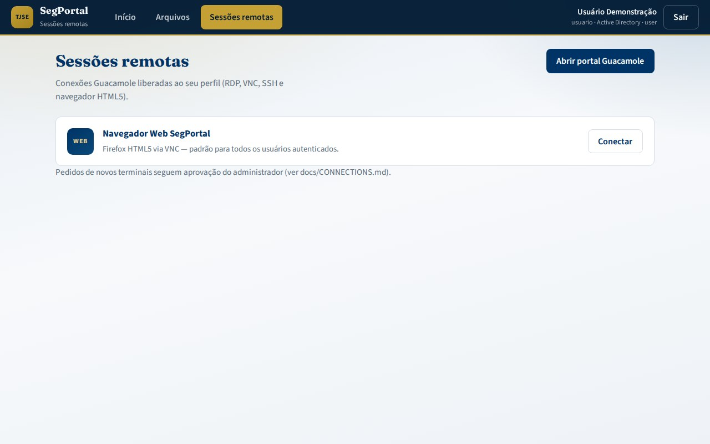

# Manual do administrador — SegPortal AQNE

Operação, configuração e suporte do SegPortal: autenticação, pastas AD, nuvem, conexões SegPortal e papéis.

Documentos técnicos: [CONFIGURATION.md](CONFIGURATION.md) · [LOCAL_ADMIN.md](LOCAL_ADMIN.md) · [ROLES.md](ROLES.md) · [CONNECTIONS.md](CONNECTIONS.md) · [FILES.md](FILES.md) · [DEPLOYMENT.md](DEPLOYMENT.md).

---

## 1. Visão dos componentes

| Serviço | Porta | Função |
|---------|-------|--------|
| **portal-auth** | **8090** | Dashboard pessoal, arquivos AD, OneDrive/Google Drive, UI HTML |
| **sessions** | **8080** | Sessões RDP/VNC/SSH/navegador HTML5 |
| **guacd** | 4822 | Proxy de protocolos |
| **postgres** | 5432 | Metadados SegPortal |
| **web-browser** | 5900 | Firefox via VNC (navegador padrão) |
| **proxy-egress** | 3128 | Saída HTTP com IP institucional |
| **segportal-bootstrap** | job | Schema, papéis, conexão padrão |


---

## 2. Contas e autenticação

### 2.1 Contas locais (via ENV, sem senhas demo)

Não há mais credenciais demo hardcoded (`admin`/`admin`, `usuario`/`usuario`). Os usuários locais são definidos por ambiente:

```bash
SEGPORTAL_LOCAL_USERS="admin:Administrador:admin:admin@aqne.jus.br;usuario:Usuário Padrão:user:usuario@aqne.jus.br"
SEGPORTAL_LOCAL_PASSWORDS="<senha_forte_admin>;<senha_forte_usuario>"
GUACAMOLE_ADMIN_PASSWORD=<senha_forte_admin_do_bootstrap>
```

| Papel | Origem |
|-------|--------|
| `admin` | quem estiver com papel `admin` em `SEGPORTAL_LOCAL_USERS` (senha do login = valor correspondente de `SEGPORTAL_LOCAL_PASSWORDS`; conta já criada pelo bootstrap) |
| `user` | quem estiver com papel `user` em `SEGPORTAL_LOCAL_USERS` |

> **Sem essas variáveis não há usuários locais.** Em produção, provisione via Secrets e use senhas diferentes por ambiente. Ver [LOCAL_ADMIN.md](LOCAL_ADMIN.md).

### 2.2 Active Directory / LDAP

LDAP real via `ldap3`: quando `LDAP_ENABLED=true` (ou `use_active_directory` no login), o portal faz **bind LDAP de verdade** com `LDAP_HOSTNAME`/`LDAP_PORT`/`LDAP_USER_BASE_DN`/`LDAP_USERNAME_ATTRIBUTE` e resolve papéis pelos grupos (`role_groups`).

1. Configure `config/ldap/ldap-settings.yaml` e variáveis `LDAP_*` no `.env`.
2. `LDAP_ENABLED=true` no SegPortal e no portal-auth.
3. No login do portal (`:8090`), o usuário marca **Active Directory** quando a conta é de domínio.

> **Fail-closed**: com LDAP habilitado, sem bind válido (credencial errada, servidor fora, grupo sem papel) → **`401`**; usuários locais **não autenticam** nesse modo. A conta local só é aceita com `LDAP_ENABLED=false`.

Atributos usados para pastas (`config/files/shares.yaml`):

| Atributo AD | Uso |
|-------------|-----|
| `homeDirectory` | UNC do home |
| `homeDrive` | Letra (ex.: H:) |
| `profilePath` | Perfil roaming (referência) |
| `extensionAttribute10` | Shares extras (opcional) |

### 2.3 MFA (TOTP e RADIUS)

**TOTP (2FA nativa):** ativada por usuário via `SEGPORTAL_TOTP_SECRETS` (JSON de segredos `base32`). Login em 2 etapas — primeiro envio sem código responde `mfa_required`; o usuário então digita o código de 6 dígitos do autenticador. Gere segredos com `pyotp.random_base32()` e use a URI `otpauth://` para cadastrar no app.

```bash
SEGPORTAL_TOTP_SECRETS='{"admin": "JBSWY3DPEHPK3PXP"}'
```

**RADIUS:** opcional no SegPortal (`MFA_ENABLED`, `MFA_RADIUS_*`). Detalhes: [CONFIGURATION.md](CONFIGURATION.md#4-mfa-radius-e-totp).

---

## 3. Arquivos, AD e nuvem (portal-auth)


### 3.1 Configuração

Arquivo: [`config/files/shares.yaml`](../config/files/shares.yaml)

- `shares.corporate` — pastas departamentais/públicas
- `shares.demo` — árvore local para laboratório (`DEMO_SHARES_ROOT`)
- `cloud_drives.onedrive` / `google_drive` — `client_id` vazio = **modo demo**

Variáveis de ambiente relevantes:

| Variável | Padrão | Função |
|----------|--------|--------|
| `PORTAL_SESSION_SECRET` | *(obrigatória)* | Assinatura do cookie de sessão — **sem ela (ou valor padrão) o portal não inicia** |
| `SEGPORTAL_COOKIE_SECURE` | `1` | Cookie de sessão `secure=True`; `0` somente em dev |
| `SEGPORTAL_LOCAL_USERS` / `SEGPORTAL_LOCAL_PASSWORDS` | *(obrigatórias p/ usuários locais)* | Usuários e senhas locais (`login:Nome:Papel:email;...` + senhas na mesma ordem) |
| `SEGPORTAL_TOTP_SECRETS` | vazio | 2FA TOTP por usuário (JSON `{user: base32}`) |
| `SEGPORTAL_RATE_LIMIT_ENABLED` | `1` | Rate limiting (login 5/min, escrita 30/min); `0` só em testes/dev |
| `DEMO_SHARES_ROOT` | `/data/shares` | Raiz das pastas demo |
| `SESSIONS_INTERNAL_URL` | `http://localhost:8090` | reservado (sessões embutidas no portal) |
| `LDAP_ENABLED` | `false` | Contexto AD no portal (LDAP real, fail-closed) |
| `PORTAL_MAX_UPLOAD_MB` | `100` | Limite de upload |

### 3.2 Operação diária

| Tarefa | Como |
|--------|------|
| Liberar pasta corporativa | Incluir em `shares.corporate` e/ou grupo AD; redeploy/config reload |
| Habilitar OAuth real | Preencher `client_id` (e tenant OneDrive) em `shares.yaml` |
| Auditar uso | Logs do container `portal-auth`; health em `GET /api/health` |
| Reset demo | Apagar volume `portal-shares` / diretório `DEMO_SHARES_ROOT` |

### 3.3 API útil

| Método | Rota |
|--------|------|
| `GET` | `/api/health` |
| `POST` | `/api/login` (`use_active_directory`; retorna `mfa_required` quando TOTP ativo) |
| `GET` | `/api/dashboard` (retorna `computers` **já filtrado pelo papel**) |
| `GET` | `/api/computers/{id}/authorize` (valida permissão **no servidor** — 403 para comum em item admin) |
| `GET/POST/DELETE` | `/api/files/{share_id}` … |
| `POST` | `/api/cloud/{provider}/mount` |

> Escrita (`upload`/`mkdir`/`rename`/`delete`/`mount`) e login são protegidos por **rate limiting**.

---

## 4. Sessões remotas e navegador padrão



1. No boot, `web-browser` sobe o Firefox/VNC e `segportal-bootstrap` cria **Navegador Web SegPortal** com permissão de leitura para todos.
2. Senha VNC **obrigatória e idêntica** nos dois lados: `VNC_PASSWORD` (serviço `web-browser`) e `SEGPORTAL_VNC_PASSWORD` (parâmetro `password` da conexão no SQL/bootstrap) — não existe mais default do tipo `segport1`.
3. Pedidos de RDP/VNC/SSH: usuário solicita → admin aprova.

```bash
./scripts/request-connection.sh usuario "RDP App X" rdp 10.10.20.10 3389 "Motivo"
./scripts/approve-connection-request.sh 1
```

Painel conceitual de aprovações:


Detalhes: [CONNECTIONS.md](CONNECTIONS.md) · [ROLES.md](ROLES.md).

---

## 5. Papéis

| Papel | Capacidades típicas |
|-------|---------------------|
| **user** | Dashboard pessoal, arquivos liberados, nuvem própria, conexões READ atribuídas |
| **admin** | Tudo do user + administração SegPortal (usuários, conexões, aprovações) |

Mapeamento LDAP → papéis: [ROLES.md](ROLES.md).

---

## 6. Deploy e saúde

### Compose local

```bash
cd segportal
cp .env.example .env
docker compose up --build
```

- Dashboard: http://localhost:8090  
- SegPortal: http://localhost:8090  

### Checagens rápidas

```bash
curl -s http://localhost:8090/api/health
curl -sf http://localhost:8090/ >/dev/null && echo portal_ok
docker compose ps
```

Kubernetes: overlays em `k8s/overlays/*` — ver [DEPLOYMENT.md](DEPLOYMENT.md).

---

## 7. Troubleshooting admin

| Problema | Verificação |
|----------|-------------|
| portal-auth unhealthy | Logs do serviço; `DEMO_SHARES_ROOT` gravável; YAML válido |
| Pastas AD vazias no demo | `shares.demo.users.<login>` em `shares.yaml` |
| OAuth nuvem falha | `client_id`, redirect URL pública, firewall de saída |
| Navegador HTML5 preto | `web-browser` healthy na 5900; `VNC_PASSWORD` = `SEGPORTAL_VNC_PASSWORD` (divergência vira *unreachable*) |
| LDAP não autentica (401) | LDAP é **fail-closed**: confira `LDAP_ENABLED`, bind DN, CA e se o grupo do usuário está mapeado em `role_groups` |

---

## 8. Checklist de go-live

- [ ] Usuários locais provisionados por ENV (sem credenciais demo) — `SEGPORTAL_LOCAL_USERS`/`SEGPORTAL_LOCAL_PASSWORDS`
- [ ] `GUACAMOLE_ADMIN_PASSWORD` e `VNC_PASSWORD`/`SEGPORTAL_VNC_PASSWORD` definidas
- [ ] `PORTAL_SESSION_SECRET` forte e única por ambiente (sem ela o portal não inicia)
- [ ] LDAP fail-closed validado (sem bind → 401); MFA TOTP/RADIUS testado (se aplicável)
- [ ] Rate limiting habilitado (`SEGPORTAL_RATE_LIMIT_ENABLED=1`)
- [ ] Catálogo de computadores: usuário comum recebe `403` em item de admin (`/api/computers/{id}/authorize`)
- [ ] `shares.yaml` com corporativos corretos
- [ ] OAuth nuvem ou decisão explícita de manter demo
- [ ] Backup do volume Postgres
- [ ] Monitoramento de `/api/health` e SegPortal
- [ ] Comunicação aos usuários com [USER_MANUAL.md](USER_MANUAL.md)

---

## 9. Imagens deste manual

| Arquivo | Conteúdo |
|---------|----------|
| [portal-admin-home.jpg](images/portal-admin-home.jpg) | Dashboard admin |
| [admin-approvals.jpg](images/admin-approvals.jpg) | Visão administrativa |
| [portal-files.jpg](images/portal-files.jpg) | Gerenciador |
| [portal-sessions.jpg](images/portal-sessions.jpg) | Sessões |
| [architecture-overview.jpg](images/architecture-overview.jpg) | Arquitetura |
| [auth-flow.jpg](images/auth-flow.jpg) | Fluxo de autenticação |
