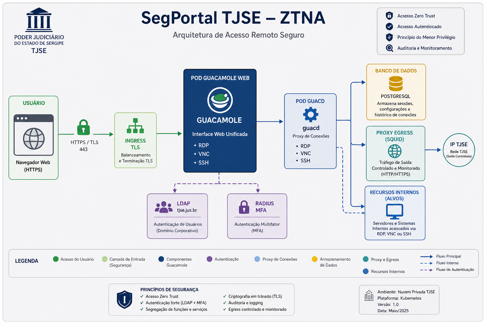
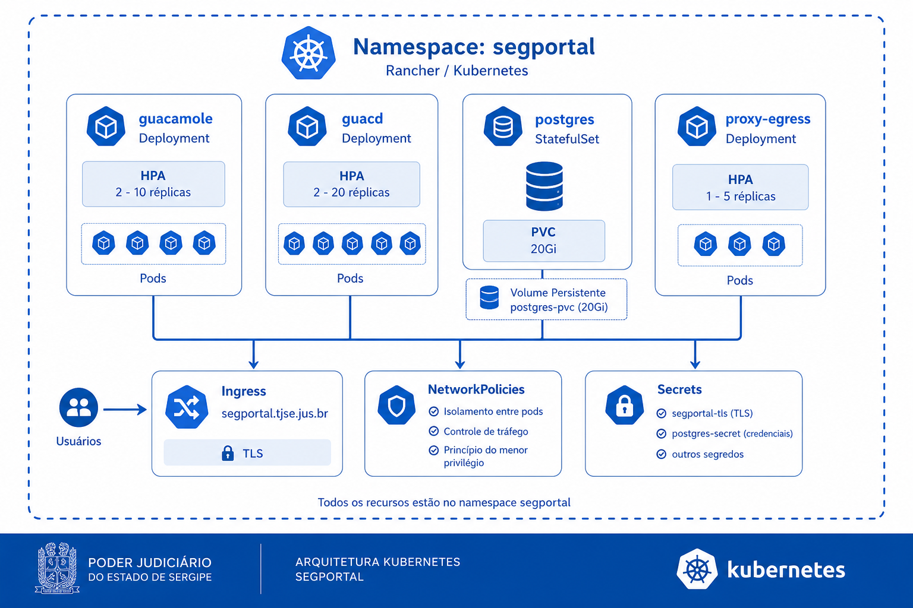

# Arquitetura — SegPortal TJSE

SegPortal implementa **Zero Trust Network Access (ZTNA)** para o TJSE usando Apache Guacamole como portal clientless.

## Visão geral



| Componente | Função |
|------------|--------|
| **Ingress** | Terminação TLS, roteamento para Guacamole |
| **Guacamole** | Portal web, autenticação LDAP + MFA RADIUS |
| **guacd** | Proxy de protocolos RDP/VNC/SSH |
| **PostgreSQL** | Metadados de conexões e sessões |
| **proxy-egress** | Squid — navegação HTTP com IP institucional |

## Fluxo de autenticação


1. Usuário acessa `https://segportal.tjse.jus.br/guacamole`
2. Guacamole autentica no Active Directory (`tjse.jus.br`) via LDAPS
3. Segundo fator validado no servidor RADIUS corporativo
4. Token de sessão emitido com timeout configurável

## Deploy Kubernetes



Cada componente roda em **pods separados** com HPA no Rancher:

- `guacamole`: 2–10 réplicas (CPU)
- `guacd`: 2–20 réplicas (CPU)
- `proxy-egress`: 1–5 réplicas (CPU)
- `postgres`: StatefulSet com PVC 20Gi

## Mockup do portal


## Modularidade

```
segportal/
├── services/guacamole/   # Imagem web + LDAP 1.5.5
├── services/guacd/       # Daemon de protocolos
├── services/egress-proxy/# Squid
├── plugins/              # Extensões futuras
└── k8s/overlays/         # dev / staging / production
```

## GitOps (Rancher Fleet)

O bundle `k8s/rancher-fleet/` sincroniza `k8s/overlays/production` nos clusters com label `env=production`.

## Decisões de design

| Decisão | Motivo |
|---------|--------|
| Guacamole 1.5.5 | Versão LTS estável com extensão LDAP oficial |
| LDAPS (636) | Criptografia obrigatória para credenciais AD |
| Pods separados | Escala independente, blast radius reduzido |
| Squid whitelist | Egress controlado substitui VPN para HTTP |

## Referências

- [MANUAL.md](MANUAL.md)
- [CONFIGURATION.md](CONFIGURATION.md)
- [DEPLOYMENT.md](DEPLOYMENT.md)
- [SECURITY.md](SECURITY.md)
