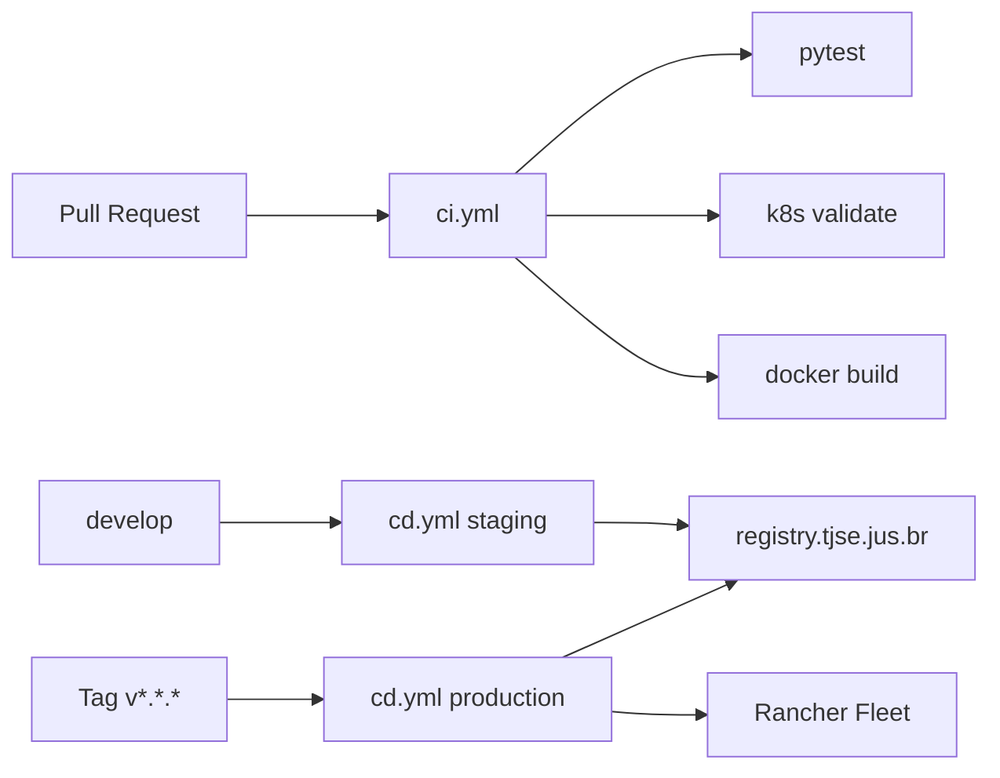

# CI/CD — SegPortal TJSE

Pipelines GitHub Actions para integração e entrega contínua.

## Visão geral



## Pipeline CI (`ci.yml`)

**Triggers:** push/PR em `main` e `develop`

| Job | Descrição |
|-----|-----------|
| `lint-and-test` | Ruff + pytest (inclui portal-auth) |
| `validate-k8s` | `kubectl kustomize` + kubeconform |
| `docker-build` | Build guacamole, guacd, egress-proxy, web-browser, **portal-auth** (sem push) |
| `compose-config` | Valida `docker-compose.yml` e `docker-compose.dev.yml` |

No monorepo `conversador-pop-se`, o workflow espelho é `.github/workflows/segportal-ci.yml` (GitHub só executa workflows na raiz do repositório).

Badge no README aponta para este workflow.

## Pipeline CD (`cd.yml`)

**Triggers:**

- Tag `v*.*.*` → build, push e deploy produção
- `workflow_dispatch` → escolha staging ou produção

> O CD **não** roda em push para `main`/`develop` — apenas CI valida o código. Isso evita falhas quando secrets do registry interno não estão configurados no GitHub.

| Job | Descrição |
|-----|-----------|
| `build-and-push` | Publica imagens em `registry.tjse.jus.br/segportal` |
| `deploy-staging` | `kubectl apply -k k8s/overlays/staging` |
| `deploy-production` | `kubectl apply -k k8s/overlays/production` |

### Secrets necessários (GitHub)

| Secret | Uso |
|--------|------|
| `REGISTRY_USERNAME` | Login no registry TJSE |
| `REGISTRY_PASSWORD` | Senha/token do registry |
| `KUBECONFIG` *(ou OIDC)* | Deploy nos clusters |

## Registry de imagens

```
registry.tjse.jus.br/segportal/guacamole:<tag>
registry.tjse.jus.br/segportal/guacd:<tag>
registry.tjse.jus.br/segportal/egress-proxy:<tag>
registry.tjse.jus.br/segportal/web-browser:<tag>
registry.tjse.jus.br/segportal/portal-auth:<tag>
```

Tags: SHA do commit, `latest`, ou versão semântica (`v1.0.0`).

O Job `segportal-bootstrap` (navegador HTML padrão) é aplicado nos overlays K8s após o deploy.

## Pull Requests

Use `.github/pull_request_template.md` — checklist inclui testes e validação K8s.

## Execução local

Equivalente ao CI:

```bash
pip install -r requirements-dev.txt
ruff check tests/
pytest -v
./scripts/validate-k8s.sh
docker compose config
```

## Rancher Fleet

Após CD de produção, o Fleet reconcilia o estado Git (`k8s/overlays/production`) nos clusters registrados.

Ver [DEPLOYMENT.md](DEPLOYMENT.md).
