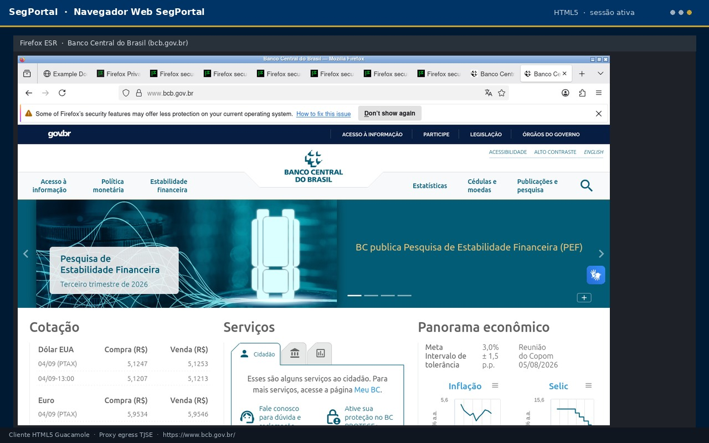

# Configuração — SegPortal AQNE

Guia passo a passo: usuários locais via ENV, admin do bootstrap, LDAP real (fail-closed), MFA (TOTP/RADIUS), rate limiting, proxy, navegador padrão, catálogo de computadores e Kubernetes.

---

## Índice

1. [Pré-requisitos](#1-pré-requisitos)
2. [Usuários locais e admin via ENV](#2-usuários-locais-e-admin-via-env)
3. [Active Directory (LDAP) — opcional](#3-active-directory-ldap--opcional)
4. [MFA (RADIUS e TOTP)](#4-mfa-radius-e-totp)
5. [SegPortal e PostgreSQL](#5-segportal-e-postgresql)
6. [Navegador HTML padrão (automático)](#6-navegador-html-padrão-automático)
7. [Proxy de egress (Squid)](#7-proxy-de-egress-squid)
8. [Branding AQNE](#8-branding-aqne)
9. [Kubernetes / Rancher](#9-kubernetes--rancher)
10. [Pedidos de conexão](#10-pedidos-de-conexão)
11. [Rate limiting](#11-rate-limiting)
12. [Catálogo de computadores (autorização server-side)](#12-catálogo-de-computadores-autorização-server-side)
13. [Validação pós-configuração](#13-validação-pós-configuração)

---

## 1. Pré-requisitos

| Item | Requisito |
|------|-----------|
| Docker / Kubernetes | Ambiente para subir os pods |
| DNS / TLS | `segportal.aqne.jus.br` (produção) |
| ENV obrigatórias | `POSTGRES_PASSWORD`, `PORTAL_SESSION_SECRET`, `GUACAMOLE_ADMIN_PASSWORD`, `VNC_PASSWORD`/`SEGPORTAL_VNC_PASSWORD`, `SEGPORTAL_LOCAL_USERS`/`SEGPORTAL_LOCAL_PASSWORDS` |
| LDAP (opcional) | AD acessível + conta de serviço + cadeia CA |
| RADIUS (opcional) | MFA corporativo |
| TOTP (opcional) | App autenticador (Google Authenticator, Aegis, etc.) + segredos gerados com `pyotp` |

**LDAP não é obrigatório.** Sem ele, o portal funciona com usuários locais definidos por ENV.

---

## 2. Usuários locais e admin via ENV

Documento completo: **[LOCAL_ADMIN.md](LOCAL_ADMIN.md)**

**Não existem mais senhas demo no código** (`admin`/`admin`, `usuario`/`usuario` foram removidas). Os usuários locais são provisionados por variáveis de ambiente:

| Variável | Formato | Obrigatória? |
|----------|---------|:-------------:|
| `SEGPORTAL_LOCAL_USERS` | `login:Nome de exibição:Papel:email;...` | Sim (para haver usuários locais) |
| `SEGPORTAL_LOCAL_PASSWORDS` | Senhas na **mesma ordem**, separadas por `;` | Sim (para haver usuários locais) |
| `GUACAMOLE_ADMIN_PASSWORD` | Senha do admin criada pelo bootstrap | **Sim** (o bootstrap não roda sem ela) |

Exemplo:

```bash
SEGPORTAL_LOCAL_USERS="admin:Administrador:admin:admin@aqne.jus.br;usuario:Usuário Padrão:user:usuario@aqne.jus.br"
SEGPORTAL_LOCAL_PASSWORDS="<senha_forte_admin>;<senha_forte_usuario>"
GUACAMOLE_ADMIN_PASSWORD=<senha_forte_admin_guacamole>
```

> **Sem `SEGPORTAL_LOCAL_USERS`/`SEGPORTAL_LOCAL_PASSWORDS` o portal não tem usuários locais**, e só aceita login se o LDAP estiver habilitado. `GUACAMOLE_ADMIN_PASSWORD` e `SEGPORTAL_VNC_PASSWORD` são obrigatórias no bootstrap.

Scripts úteis:

```bash
./scripts/change-local-password.sh admin 'NovaSenhaForte!'
./scripts/delete-local-user.sh admin --disable
```

---

## 3. Active Directory (LDAP) — opcional

Referência: `config/ldap/ldap-settings.yaml` e variáveis `.env` / ConfigMap / Secret.

| Campo | Variável | Descrição |
|-------|----------|-----------|
| Liga LDAP | `LDAP_ENABLED` | `true` / `false` (padrão `false`) |
| Servidor | `LDAP_HOSTNAME` | Ex.: `ldap.aqne.jus.br` |
| Porta | `LDAP_PORT` | `636` (LDAPS) ou `389` |
| Domínio | yaml `ldap.domain` | `aqne.jus.br` |
| Base usuários / grupos | `LDAP_USER_BASE_DN` / `LDAP_GROUP_BASE_DN` | DNs do AD |
| Atributo UID | `LDAP_USERNAME_ATTRIBUTE` | `sAMAccountName` |
| Bind | `LDAP_SEARCH_BIND_DN` / `LDAP_SEARCH_BIND_PASSWORD` | Conta de serviço |
| CA | `LDAP_CA_CHAIN_FILE` | PEM em `/etc/certs/` |
| Grupos de papel | `role_groups` (yaml) | Mapeamento grupo AD → papel |

### Comportamento (LDAP real via `ldap3`)

Com `LDAP_ENABLED=true` (ou `use_active_directory` no login do portal), o portal faz **bind LDAP real** usando `LDAP_HOSTNAME`, `LDAP_PORT`, `LDAP_USER_BASE_DN` e `LDAP_USERNAME_ATTRIBUTE`, e resolve os grupos em `role_groups` para determinar o papel (admin/user).

- **Fail-closed**: sem bind válido (credencial errada, servidor fora, grupo sem papel mapeado) → **`401`**.
- Nesse modo, **usuários locais não autenticam** — a conta local só é aceita com `LDAP_ENABLED=false`.
- Alteração de políticas (ex.: grupo → papel) exige reinício do serviço.

Procedimento: preencher CA e secrets → `LDAP_ENABLED=true` → reiniciar SegPortal → testar login AD (esperado: sucesso com grupo válido, `401` caso contrário).

| Grupo AD | Papel |
|----------|-------|
| `GG-SegPortal-Admin` | Administrador |
| `GG-SegPortal-Usuarios` | Usuário |
| `GG-SegPortal-Financeiro` / `Consulta` / `Externo` | Negócio |

Ver [ROLES.md](ROLES.md).

---

## 4. MFA (RADIUS e TOTP)

Duas opções de segundo fator: **TOTP** (nativo no portal, por usuário via ENV) e **RADIUS** (corporativo).

### 4.1 MFA TOTP (2FA)

Ativado por usuário via `SEGPORTAL_TOTP_SECRETS` (JSON com `base32` por usuário):

```bash
SEGPORTAL_TOTP_SECRETS='{"admin": "JBSWY3DPEHPK3PXP"}'
```

**Login em 2 etapas:**

1. Primeira chamada a `POST /api/login` (usuário + senha), **sem** código → resposta `mfa_required`.
2. Usuário digita o **código de 6 dígitos** do app autenticador e envia novamente (usuário + senha + código) → sessão liberada.

**Gerar um segredo** (requer `pyotp`):

```bash
pip install pyotp
python -c "import pyotp;print(pyotp.random_base32())"
# ex.: JBSWY3DPEHPK3PXP
```

**Obter a URI `otpauth`** (para inserir no app autenticador / gerar QR):

```python
import pyotp
secret = "JBSWY3DPEHPK3PXP"
uri = pyotp.totp.TOTP(secret).provisioning_uri(
    name="admin", issuer_name="SegPortal AQNE")
print(uri)
```

O valor de `secret` acima vira o valor de `SEGPORTAL_TOTP_SECRETS["admin"]`. Provisione o JSON via **Secret** (K8s) ou `.env` fora do repositório. Usuários **sem** entrada nesse JSON não fazem 2FA (login direto).

### 4.2 MFA via RADIUS

```bash
MFA_ENABLED=true
MFA_RADIUS_HOSTNAME=radius.aqne.jus.br
MFA_RADIUS_PORT=1812
MFA_RADIUS_SECRET=<shared_secret>
```

Recomendado com LDAP. Com `MFA_ENABLED=false`, o entrypoint remove chaves `radius-*`.

---

## 5. SegPortal e PostgreSQL

| Variável | Descrição | Padrão |
|----------|-----------|--------|
| `POSTGRES_DB` | Banco interno de sessões | `segportal_sessions` (legado: nome técnico do schema) |
| `POSTGRES_USER` | Usuário do banco de sessões | `segportal_sessions` |
| `POSTGRES_PASSWORD` | Senha | *(obrigatório)* |
| `SESSION_TIMEOUT_MINUTES` | Timeout | `60` |

### Variáveis obrigatórias do portal

| Variável | Descrição |
|----------|-----------|
| `PORTAL_SESSION_SECRET` | **Obrigatória** — assinatura do cookie de sessão. **Sem ela (ou com valor padrão) o portal não inicia.** Gere com `openssl rand -hex 32`. |
| `SEGPORTAL_COOKIE_SECURE` | Cookie de sessão com `secure=True` (padrão). Defina `0` **somente em desenvolvimento** (HTTP local). |
| `GUACAMOLE_ADMIN_PASSWORD` | Senha do admin criada pelo bootstrap (ver §2). |
| `VNC_PASSWORD` / `SEGPORTAL_VNC_PASSWORD` | Senha VNC do navegador padrão — **obrigatórias, sem defaults em claro** (ver §6). |

O serviço **`segportal-bootstrap`** aplica schema (se necessário), papéis, admin (`GUACAMOLE_ADMIN_PASSWORD`), a conexão do navegador (com `SEGPORTAL_VNC_PASSWORD`) e os usuários locais — não dependa de seed manual.

```bash
./scripts/bootstrap-segportal.sh   # idempotente
```

---

## 6. Navegador HTML padrão (automático)

| Item | Valor |
|------|-------|
| Serviço | `web-browser` (Firefox / VNC `:5900`) |
| Conexão SegPortal | **Navegador Web SegPortal** |
| Permissão | `READ` para todos os usuários no boot |
| Senha VNC | `VNC_PASSWORD` no serviço `web-browser` **=** `SEGPORTAL_VNC_PASSWORD` no bootstrap (SQL da conexão) — **obrigatórias, sem defaults em claro** |
| Docs | [CONNECTIONS.md](CONNECTIONS.md) |

```bash
VNC_PASSWORD=<senha_forte_vnc>
SEGPORTAL_VNC_PASSWORD=<mesma_senha_forte_vnc>   # usada no SQL da conexão (bootstrap)
```

> Em produção **defina as duas**; não existe mais senha padrão tipo `segport1` no código. Senhas divergentes geram *“remote desktop server unreachable”*.

Compose e Job K8s (`k8s/bootstrap`) já incluem o bootstrap. Imagem: `services/web-browser/Dockerfile`.



---

## 7. Proxy de egress (Squid)

Arquivos: `config/proxy/squid.conf` e `services/egress-proxy/`. Serviço Compose/K8s: `proxy-egress`.

Revise a whitelist antes de produção.

---

## 8. Branding AQNE

Arquivos em `services/branding/`.

---

## 9. Kubernetes / Rancher

```bash
kubectl create namespace segportal
# secrets a partir de k8s/*/secret.example.yaml
kubectl apply -k k8s/overlays/production
# Job segportal-bootstrap cria navegador padrão + admin + usuários locais
kubectl -n segportal wait --for=condition=complete job/segportal-bootstrap --timeout=300s
```

No Rancher, provisione como **Secrets**: `SEGPORTAL_LOCAL_USERS`, `SEGPORTAL_LOCAL_PASSWORDS`, `GUACAMOLE_ADMIN_PASSWORD`, `PORTAL_SESSION_SECRET`, `VNC_PASSWORD`/`SEGPORTAL_VNC_PASSWORD`, `SEGPORTAL_TOTP_SECRETS` (nunca em ConfigMaps).

---

## 10. Pedidos de conexão

Usuário solicita; admin aprova. Política: `config/connections/requests.yaml`.

```bash
./scripts/request-connection.sh usuario "RDP X" rdp 10.10.20.51 3389 "Justificativa"
./scripts/approve-connection-request.sh 1
```

Cadastro manual na UI (Settings → Connections) continua válido para o admin.

---

## 11. Rate limiting

O portal usa **slowapi** para limitar requisições:

| Rota | Limite |
|------|--------|
| Login (`POST /api/login`) | **5/min** |
| Escrita da API (`upload` / `mkdir` / `rename` / `delete` / `mount`) | **30/min** |

Desativável para testes/desenvolvimento:

```bash
SEGPORTAL_RATE_LIMIT_ENABLED=0
```

Acima do limite a API responde **`429 Too Many Requests`**. Mantenha habilitado em produção.

---

## 12. Catálogo de computadores (autorização server-side)

O catálogo de computadores **não é mais hardcoded no frontend**:

- `GET /api/dashboard` retorna `computers` **já filtrado pelo papel** (admin vê tudo; usuário comum vê somente o que lhe foi liberado).
- `GET /api/computers/{id}/authorize` valida a permissão **no servidor** antes de abrir a sessão.
  - Usuário **comum** tentando item de **admin** → **`403 Forbidden`**.

Não há como burlar a autorização pelo cliente: mesmo forjando um `id`, o servidor rejeita. Ver [FILES.md](FILES.md) e [ADMIN_MANUAL.md](ADMIN_MANUAL.md).

---

## 13. Validação pós-configuração

- [ ] Portal inicia com `PORTAL_SESSION_SECRET` definida; **falha** (recusa iniciar) sem ela
- [ ] Usuários locais de `SEGPORTAL_LOCAL_USERS`/`SEGPORTAL_LOCAL_PASSWORDS` logam **sem** LDAP
- [ ] Conexão **Navegador Web SegPortal** aparece com senha VNC definida (`VNC_PASSWORD` = `SEGPORTAL_VNC_PASSWORD`)
- [ ] `GUACAMOLE_ADMIN_PASSWORD` obrigatória no bootstrap (job falha/aborta sem ela)
- [ ] MFA TOTP validado: primeiro login responde `mfa_required`; código de 6 dígitos libera a sessão
- [ ] Rate limiting ativo (após exceder limites → `429`)
- [ ] (Se LDAP) login AD com bind válido; **sem bind → `401`** (fail-closed)
- [ ] Usuário comum recebe **`403`** em `/api/computers/{id}/authorize` de item admin
- [ ] Usuário normal não vê Settings administrativos
- [ ] Admin consegue aprovar pedidos

```bash
pytest tests -v
./scripts/validate-k8s.sh
```

## Referências

- [LOCAL_ADMIN.md](LOCAL_ADMIN.md)
- [ROLES.md](ROLES.md)
- [CONNECTIONS.md](CONNECTIONS.md)
- [SECURITY.md](SECURITY.md)
- [MANUAL.md](MANUAL.md)