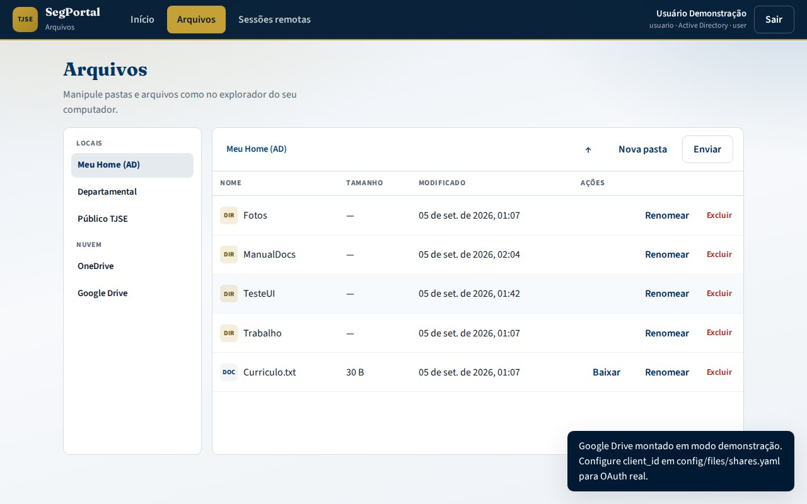

# Arquivos e nuvem — SegPortal

O **portal-auth** (porta **8090**) oferece o dashboard pessoal com:

1. **Compartilhamentos Active Directory** — home (`homeDirectory` / `homeDrive`), pastas departamentais e públicos  
2. **OneDrive e Google Drive** — montagem opcional no dashboard  
3. **Gerenciador HTML** — listar, enviar (arrastar e soltar), criar pasta, renomear, baixar e excluir  

Manuais: [USER_MANUAL.md](USER_MANUAL.md) · [ADMIN_MANUAL.md](ADMIN_MANUAL.md).


---

## Fluxo com Active Directory

1. Usuário marca **Autenticar via Active Directory** (ou `LDAP_ENABLED=true`)  
2. O portal resolve shares em [`config/files/shares.yaml`](../config/files/shares.yaml) (`shares.ad_attributes` + `shares.corporate`)  
3. Em produção, o UNC do `homeDirectory` é montado no backend; em demo, usa árvore local em `DEMO_SHARES_ROOT`  


---

## OneDrive / Google Drive


```yaml
cloud_drives:
  onedrive:
    enabled: true
    client_id: ""   # vazio = modo demo
  google_drive:
    enabled: true
    client_id: ""
```

Sem `client_id`, a montagem cria pasta demo sob `DEMO_SHARES_ROOT/cloud/...`.

---

## API (resumo)

| Método | Rota | Uso |
|--------|------|-----|
| POST | `/api/login` | Sessão cookie (`use_active_directory`) |
| GET | `/api/dashboard` | Shares AD + estado das nuvens |
| GET | `/api/files/{share_id}` | Listar pasta |
| POST | `/api/files/{share_id}/upload` | Enviar arquivo |
| POST | `/api/files/{share_id}/mkdir` | Criar pasta |
| POST | `/api/cloud/{provider}/mount` | Montar OneDrive / Google Drive |
| GET | `/api/health` | Saúde do serviço |

---

## UI

Interface em HTML/CSS/JS (`services/portal-auth/static`):

- Tipografia Source Sans 3 + Fraunces  
- Cores institucionais TJSE (navy / ouro)  
- Abas **Início · Arquivos · Sessões**  
- Diálogo acessível para nova pasta/renomear  
- Arrastar e soltar; alvos de clique ≥ 44px  



---

## Operação (admin)

Ver [ADMIN_MANUAL.md](ADMIN_MANUAL.md) §3. Variáveis: `PORTAL_SESSION_SECRET`, `DEMO_SHARES_ROOT`, `GUACAMOLE_PUBLIC_URL`, `LDAP_ENABLED`.
