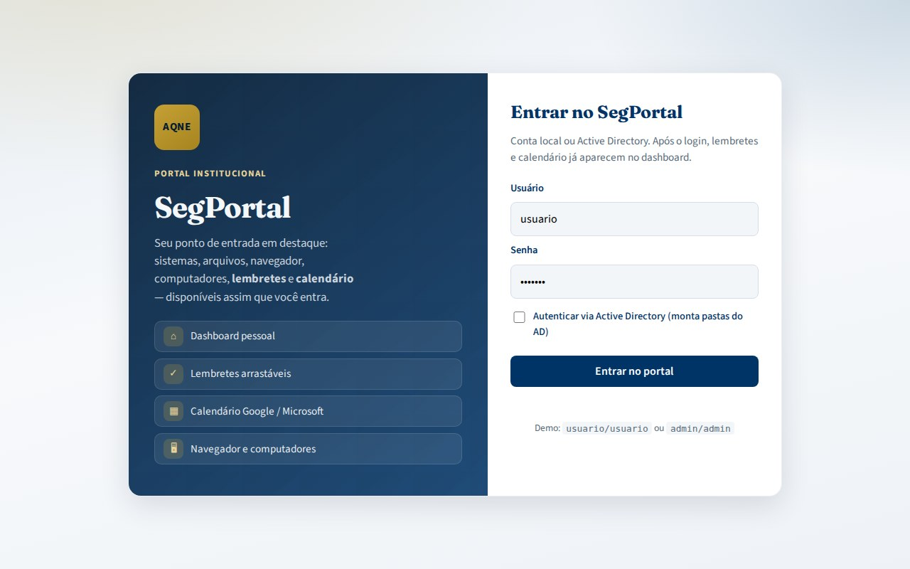
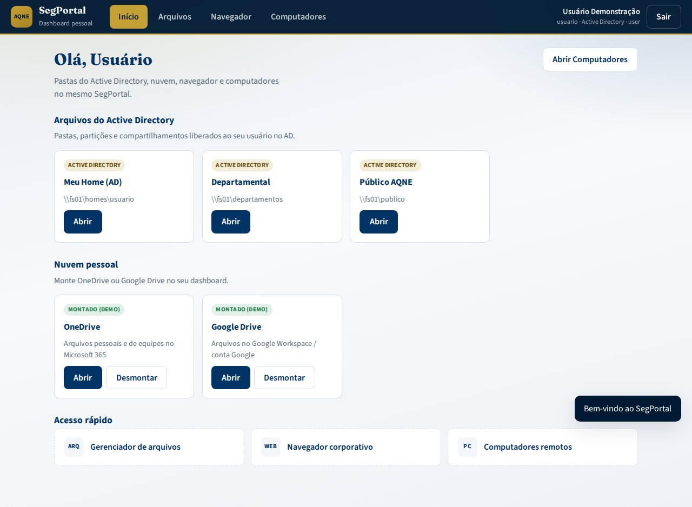
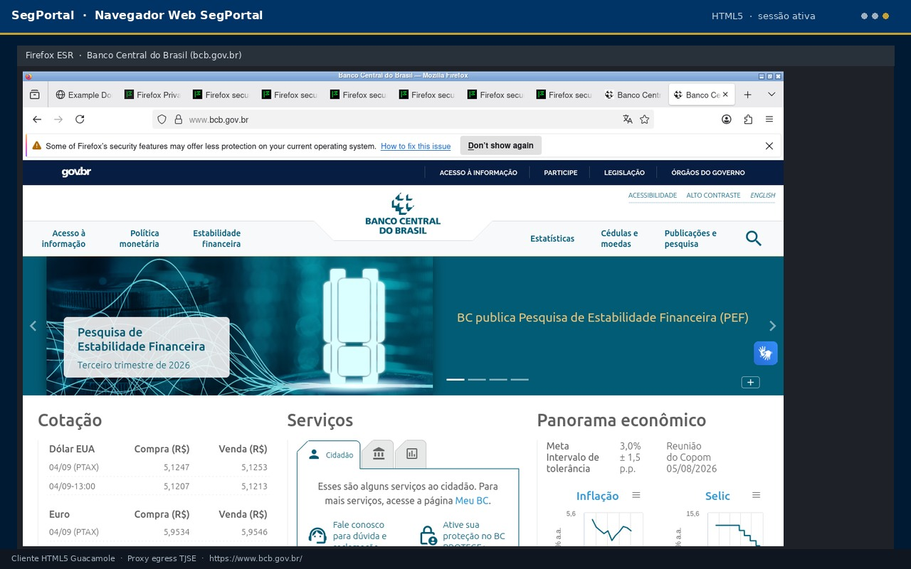
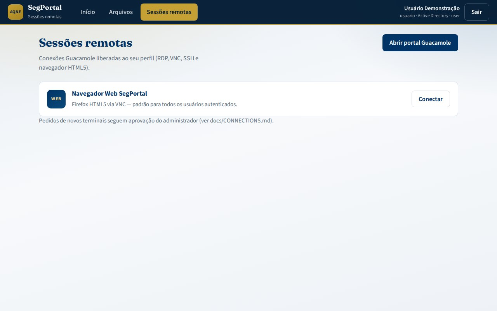

# Guia de uso — SegPortal AQNE

Fluxo visual do usuário final. Manuais completos: [USER_MANUAL.md](USER_MANUAL.md) · [MANUAL.md](MANUAL.md).

---

## Visão geral


1. Autenticar no dashboard (`:8090`) — local e/ou Active Directory (portal em destaque no login)  
2. Usar pastas AD e montar OneDrive/Google Drive  
3. Gerenciar arquivos no explorador HTML  
4. Usar o **navegador corporativo** embutido (aba Navegador)  
5. Abrir **computadores** remotos liberados (aba Computadores)  
6. Organizar o dia com **lembretes arrastáveis** e **calendário** deslizante (Google / Microsoft)  
7. Se precisar de computador extra, **solicitar** e aguardar o admin  

---

## 1. Login



| Campo | Produção | Demo local |
|-------|----------|------------|
| Usuário | `sAMAccountName` ou local | `usuario` / `admin` |
| Senha | AD / local | `usuario` / `admin` |
| Active Directory | Marque se for conta de domínio | Marque para ver shares demo AD |
| MFA | Se habilitado no SegPortal | Não exigido no compose.dev |

URLs demo: dashboard `http://localhost:8090` · SegPortal `http://localhost:8090`.

---

## 2. Dashboard pessoal


| Área | Uso |
|------|-----|
| **Arquivos do Active Directory** | Home, departamental, público |
| **Nuvem pessoal** | Montar/abrir OneDrive e Google Drive |
| **Acesso rápido** | Atalhos para arquivos e navegador web |
| **Abrir Computadores** | Abre a aba de desktops/aplicações no próprio SegPortal |
| **Navegador** | Navegação HTML5 embutida na mesma aba |
| **Lembretes** | Painel flutuante arrastável (posição memorizada) |
| **Calendário** | Aba lateral deslizante com Google Calendar / Microsoft Outlook |

### 2.1 Arquivos corporativos e nuvem



1. Marque AD no login (quando aplicável)  
2. Em **Nuvem pessoal**, clique em **Montar**  
3. Em **Arquivos**, navegue, envie (arrastar/soltar), crie pastas  


Detalhes: [FILES.md](FILES.md) · [USER_MANUAL.md](USER_MANUAL.md).

### 2.2 Lembretes e calendário

- **Lembretes**: painel flutuante disponível no login; arraste pelo cabeçalho para qualquer canto (posição salva por usuário).
- **Calendário**: aba lateral deslizante (botão **Calendário** ou aba na borda direita). Provedores: Google, Microsoft ou agenda local. Cole a URL pública de embed para conectar.

---

## 3. Navegador corporativo (aba Navegador)


O **Navegador Web SegPortal** está embutido como aba do próprio portal: o conteúdo abre **na mesma aba** do navegador do usuário — sem redirecionar para outro sistema.

**Exemplo:** na barra de endereço digite `https://www.bcb.gov.br/` (Banco Central / Bacen) ou use o atalho Bacen. A navegação corporativa segue as políticas de egresso do portal.



### 3.1 Computadores


Use a aba **Computadores** ou o botão **Abrir Computadores** no Início. Desktops e aplicações liberados abrem **dentro do SegPortal** (mesma aba).



---

## 4. Pedido de computador adicional

```bash
./scripts/request-connection.sh usuario "RDP Financeiro" rdp 10.10.20.51 3389 "Justificativa"
./scripts/approve-connection-request.sh 1
```


---

## 5. Encerramento

- **Fechar sessão** na aba Computadores  
- Timeout por inatividade  
- **Sair** no dashboard  

---

## Imagens

| Arquivo | Conteúdo |
|---------|----------|
| [segportal-mockup.jpg](images/segportal-mockup.jpg) | Login / capa |
| [usage-login.jpg](images/usage-login.jpg) | Login |
| [usage-portal.jpg](images/usage-portal.jpg) | Dashboard |
| [portal-files.jpg](images/portal-files.jpg) | Arquivos |
| [portal-cloud-mounted.jpg](images/portal-cloud-mounted.jpg) | Nuvem |
| [usage-browser.jpg](images/usage-browser.jpg) | Aba Navegador embutida |
| [usage-browser-bacen.jpg](images/usage-browser-bacen.jpg) | Navegador no Bacen |
| [portal-sessions.jpg](images/portal-sessions.jpg) | Aba Computadores |
| [usage-session.jpg](images/usage-session.jpg) | Sessão de computador |
| [admin-approvals.jpg](images/admin-approvals.jpg) | Admin |
