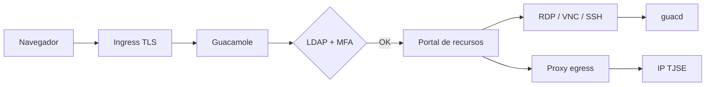
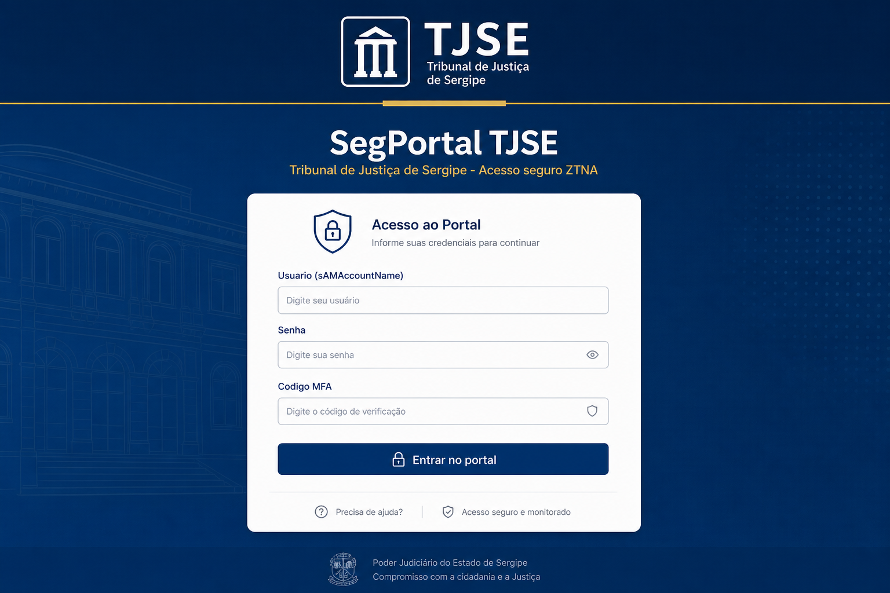
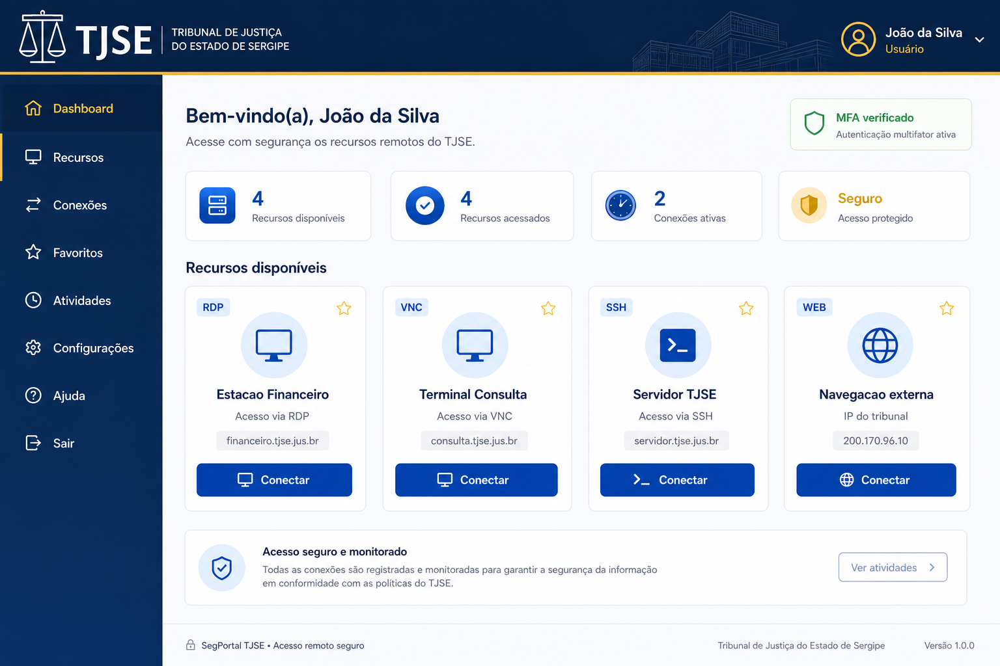
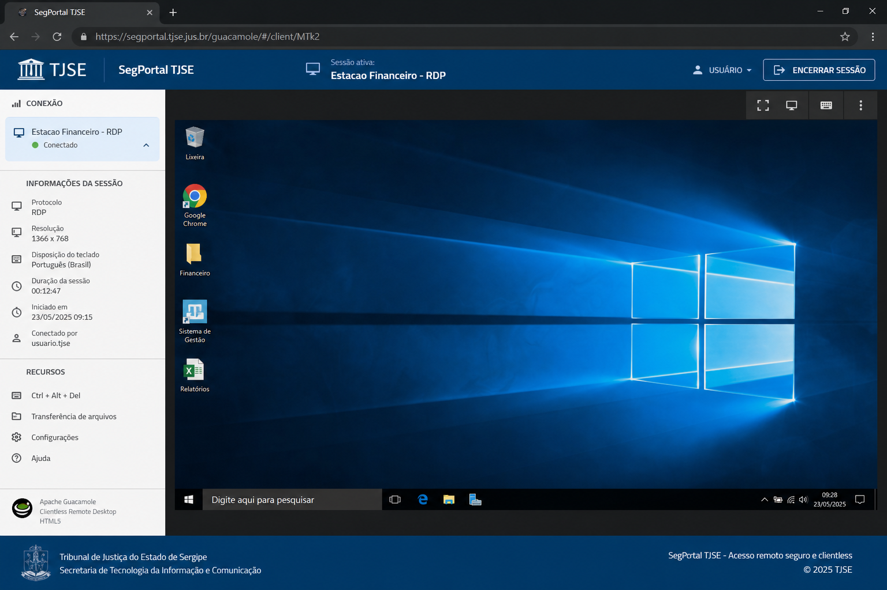
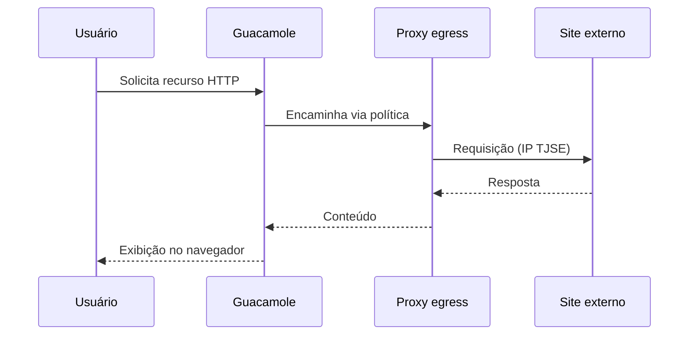

# Guia de uso — SegPortal TJSE

Este documento descreve o fluxo do usuário final e exemplos visuais do portal ZTNA.

## Visão geral do fluxo

## 1. Login no portal

O usuário acessa `https://segportal.tjse.jus.br` e informa:

1. **Usuário** — `sAMAccountName` do domínio `tjse.jus.br`
2. **Senha** — credencial do Active Directory
3. **Código MFA** — token do autenticador ou RADIUS corporativo

Após autenticação bem-sucedida, o Guacamole emite um token de sessão com timeout configurável (padrão: 60 minutos de inatividade).

## 2. Portal de recursos autorizados

Na home, o usuário vê apenas conexões permitidas pelos **grupos AD** aos quais pertence:

| Tipo | Uso típico |
|------|------------|
| **RDP** | Estações Windows, servidores de aplicação |
| **VNC** | Terminais Linux, estações de consulta |
| **SSH** | Administração de servidores |
| **Proxy** | Sites externos que exigem IP do tribunal |

## 3. Sessão clientless (sem VPN)

Ao clicar em **Conectar**, o desktop remoto abre **dentro do navegador** — sem instalar cliente VPN ou RDP:

Cada sessão é **individualizada**: um processo guacd dedicado, sem compartilhamento de contexto entre usuários.

## 4. Navegação externa (egress)

Para recursos HTTP/HTTPS na whitelist, o tráfego passa pelo pod `proxy-egress` e sai com o **IP institucional** do TJSE — substituindo a necessidade de VPN para esses destinos.

## 5. Encerramento de sessão

- **Logout** manual no menu do portal
- **Timeout** por inatividade (`api-session-timeout`)
- **Limite** de sessões simultâneas por usuário (`max-concurrent-connections`)

## Diagramas adicionais

- [Arquitetura completa](images/architecture-overview.svg)
- [Fluxo de autenticação](images/auth-flow.svg)
- [Deploy Kubernetes](images/k8s-pods.svg)
- [Mockup interativo](../mockup/segportal-mockup.html)

## Perfis e grupos AD (exemplo)

| Grupo AD | Recursos |
|----------|----------|
| `GG-SegPortal-Financeiro` | RDP estações financeiro |
| `GG-SegPortal-Consulta` | VNC terminais processuais |
| `GG-SegPortal-Admin` | SSH servidores + proxy egress |

Configure o mapeamento em [CONFIGURATION.md](CONFIGURATION.md).
